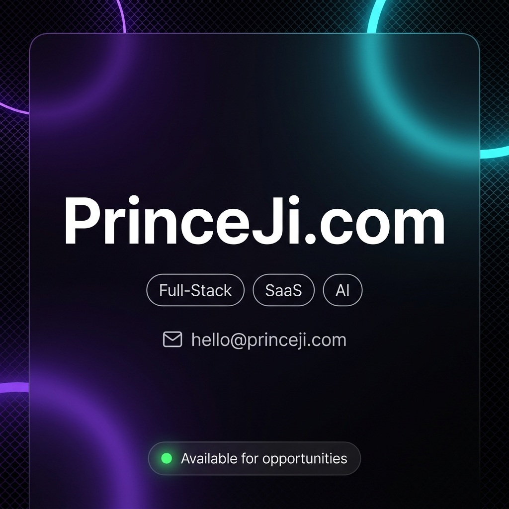

<div align="center">

<!-- ANIMATED TYPING HEADER — no static image dependency, works immediately -->
<a href="https://princeji.com">
  
</a>

<!-- CUSTOM BANNER -->
<a href="https://princeji.com">
  
</a>

<br/>

<!-- SOCIAL BADGES — clean row, not floating randomly -->
<a href="mailto:hello@princeji.com"></a>&nbsp;
<a href="https://www.linkedin.com/in/princeji"></a>&nbsp;
<a href="https://princeji.com"></a>&nbsp;


</div>

<!-- ═══════════════════════════════════════════════ -->

## `> whoami`

```js
const prince = {
  location: "India",
  focus: ["SaaS Products", "AI Automation", "Full-Stack Web Apps"],
  currentlyBuilding: "A platform that auto-generates & publishes YouTube Shorts",
  funFact: "I automate things so hard that even my automation has automation",
};
```

- 🔭 &nbsp;Building a **SaaS product** with async task pipelines, AI integrations, and payment workflows
- 🎬 &nbsp;Into **AI-powered automation** — video gen, TTS, image processing, all stitched with FFmpeg
- ⚡ &nbsp;I like writing systems that run **without me babysitting them**
- 🌐 &nbsp;Portfolio → [**princeji.com**](https://princeji.com)

<!-- ═══════════════════════════════════════════════ -->

## `> tech --stack`

<p align="center">

[](https://princeji.com)

[](https://princeji.com)

</p>

<!-- ═══════════════════════════════════════════════ -->

## `> ls projects/`

<div align="center">

<a href="https://github.com/princeji100/Tmdb">
  
</a>
<a href="https://github.com/princeji100/projects">
  
</a>

</div>

> **Tmdb** — Movie discovery app with search, smooth page transitions, and responsive design. React + Tailwind + Framer Motion + TMDB API.
>
> **projects** — Frontend collection: portfolio site, linktree clone, easybank landing, mortgage calculator, and more.

<!-- ═══════════════════════════════════════════════ -->

## `> git stats`

<div align="center">


<br/><br/>


</div>

<!-- ═══════════════════════════════════════════════ -->

## `> contrib --snake`

<div align="center">

<picture>
  <source media="(prefers-color-scheme: dark)" srcset="https://raw.githubusercontent.com/princeji100/princeji100/output/github-snake-dark.svg" />
  <source media="(prefers-color-scheme: light)" srcset="https://raw.githubusercontent.com/princeji100/princeji100/output/github-snake.svg" />
  
</picture>

</div>

<!-- ═══════════════════════════════════════════════ -->

<div align="center">


<br/><br/>

**Open to collabs — if you're building something interesting, let's talk.**


</div>
